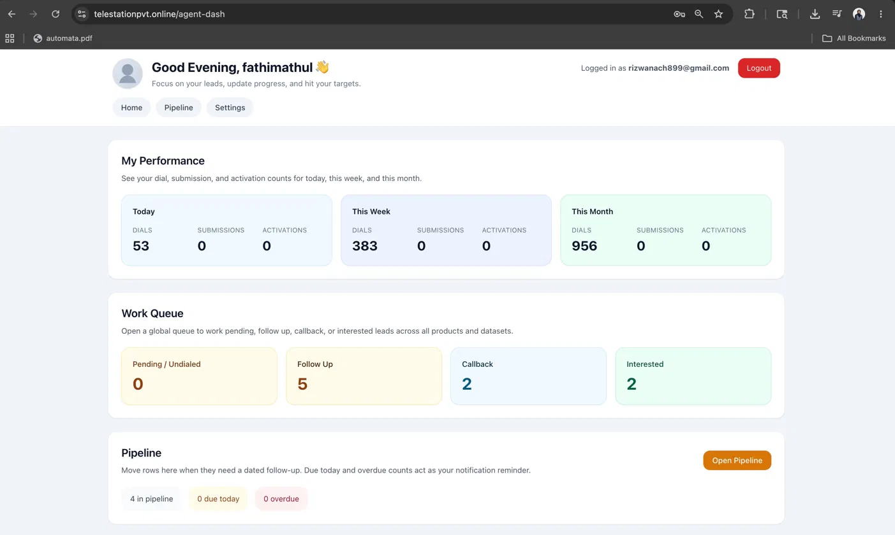
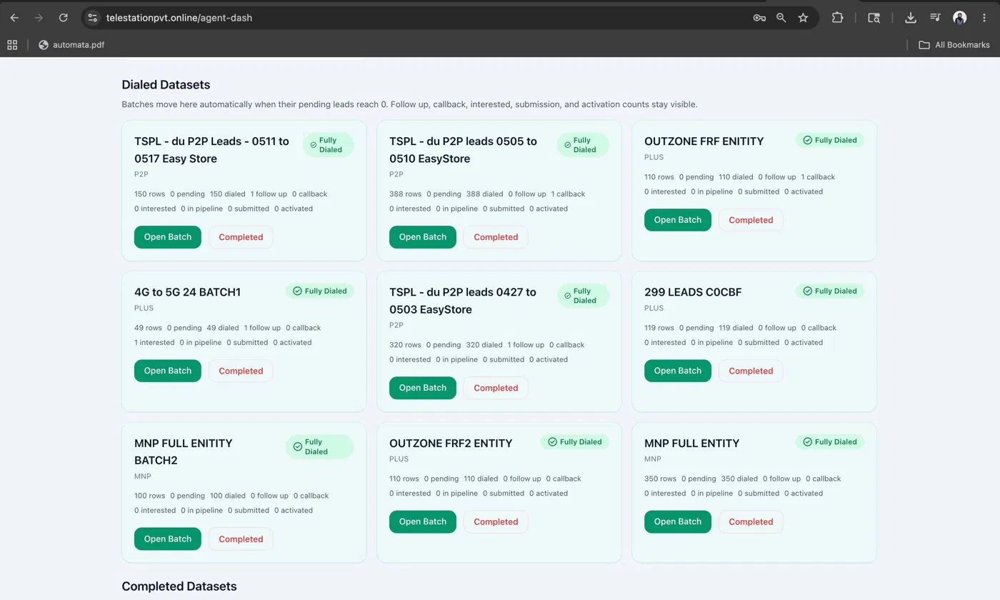
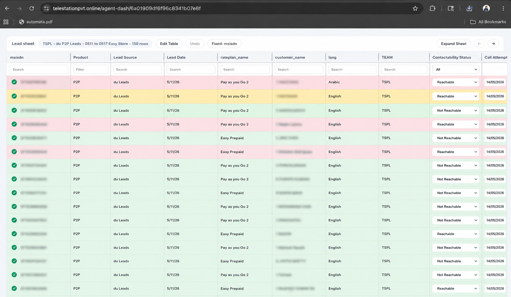
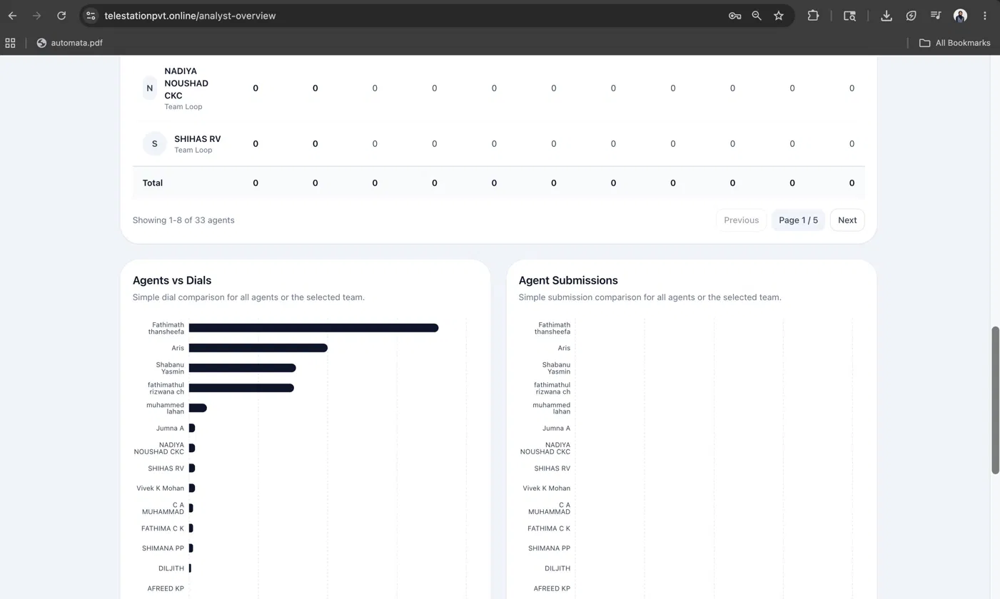

# LeadSync CRM

A production-grade, role-based lead distribution and analytics platform built with the MERN stack. Designed to manage high-volume lead pipelines across large agent teams with real-time updates and optimised performance.

> Built as an internal tool at TSPL Corp — serving 100+ agents across 8,500+ leads.

---

## 🚀 Performance Highlights

- ⚡ Redis caching reduced API response times by **94%** (1.21s → 78ms)
- 📋 Lead assignment time reduced from **hours to seconds**
- 📦 MongoDB aggregation pipelines optimised for **initial load under 2 seconds**
- 📁 Bulk CSV/XLSX import supporting **8,500+ lead datasets**

---

## 📸 Screenshots

### Agent Dashboard — Performance Overview


### Agent Dashboard — Dataset Management


### Agent Dashboard — Lead Sheet


### Analyst Dashboard — Team Performance Overview


---

## ✨ Features

- **Automated Lead Distribution** — role-based engine that assigns leads instantly based on agent availability and role
- **5 Role-Based Dashboards** — Super Admin, Manager, Team Lead, Data Analyst, Agent — each with scoped access and relevant views
- **Real-Time Updates** — Socket.io integration for live lead status changes and notifications across all dashboards
- **Redis Caching** — role-aware TTL strategy to serve repeated queries near-instantly
- **Bulk Import** — CSV/XLSX upload via Multer for mass lead ingestion
- **Pipeline Analytics** — Recharts-powered visual dashboards for conversion tracking and team performance
- **JWT Authentication** — secure login with role-based middleware protecting all routes

---

## 🛠 Tech Stack

| Layer | Technology |
|-------|------------|
| Frontend | React.js, Redux Toolkit, Tailwind CSS, Recharts |
| Backend | Node.js, Express.js |
| Database | MongoDB, Mongoose |
| Caching | Redis, ioredis, Socket.IO Redis Adapter |
| Real-Time | Socket.io |
| File Handling | Multer (CSV/XLSX import) |
| Auth | JWT, Role-Based Middleware |

---

## 🏗 Architecture Overview

```
client/
├── src/
│   ├── components/        # Reusable UI components
│   ├── pages/             # Role-based dashboard pages
│   ├── store/             # Redux Toolkit slices
│   └── socket/            # Socket.io client setup

server/
├── controllers/           # Route handlers
├── middleware/            # Auth + role guards
├── models/                # Mongoose schemas
├── routes/                # Express route definitions
├── services/              # Lead distribution engine
└── utils/                 # Redis cache helpers
```

---

## 👥 Roles & Access

| Role | Access |
|------|--------|
| Super Admin | Full system access, agent management, all analytics |
| Manager | Team overview, lead pipeline, performance reports |
| Team Lead | Team leads tracking, lead reassignment |
| Data Analyst | Analytics dashboards, CSV import, reporting |
| Agent | Personal lead list, status updates, targets |

---

## 👨‍💻 Contributors

- **Lufna Nasrin** — Backend architecture, Redis caching, lead distribution engine, real-time system, frontend dashboards
- **Archana** — Frontend components, UI implementation

---

## 📄 License

This project was built as an internal production tool. Code is shared for portfolio purposes.
